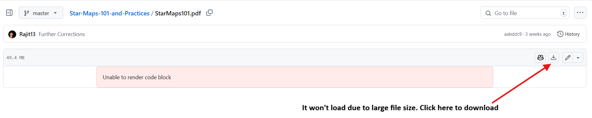

# Star Maps 101 and Practices

Get the latest pdf version [Go here](StarMaps101.pdf) and follow the instructions shown below

---

**Star Maps 101 and Practices** is a notebook/guide that I made in preparation for *the International Olympiad on Astronomy and Astrophysics*. This contains a detailed description of Star Map/Chart analysis as well as a brief introduction to Astronomical Observations practically. This book is used in the training of the Bangladesh team at the [Bangladesh Olympiad on Astronomy and Astrophysics](https://bdoaa.org). 

## Introduction

I started this book immediately after my Olympiad experience in 2016. However, as I joined Graduate school and my academics took precedence, I could not fully devote my time and resources to the book. As a result, I have not been able to cover all the topics I had set out to cover. I am currently working on improving the Telescopic observations part and am willing to add detailed notes on the Celestial Coordinate System. Hence, I would like to request that all Astronomy enthusiasts contribute to extending this book and making it more complete. **It seems that due to the file size, I won't be able to update this book anymore.** 

## How to contribute?

This book has been written in [LaTeX](https://www.latex-project.org/) and published via GitHub, hence a working knowledge of TeX and git is expected. The best way to contribute to this repository is by following these steps:

- Fork this repository.
- Make changes in a separate branch.
- Create a pull request with an adequate description of changes.

For interested contributors who are not familiar with these terms, the QGIS-documentation repo explains these steps in detail for people making their [first contribution](https://github.com/gitty-coder/QGIS-Documentation/blob/master/docs/documentation_guidelines/first_contribution.rst).

#### If you would like to contribute, it would be a good idea to contact me by email at farahoshwadhin.13@gmail.com
---

Shield: [![CC BY-NC-SA 4.0][cc-by-nc-sa-shield]][cc-by-nc-sa]

This work is licensed under a
[Creative Commons Attribution-NonCommercial-ShareAlike 4.0 International License][cc-by-nc-sa].

[![CC BY-NC-SA 4.0][cc-by-nc-sa-image]][cc-by-nc-sa]

[cc-by-nc-sa]: http://creativecommons.org/licenses/by-nc-sa/4.0/
[cc-by-nc-sa-image]: https://licensebuttons.net/l/by-nc-sa/4.0/88x31.png
[cc-by-nc-sa-shield]: https://img.shields.io/badge/License-CC%20BY--NC--SA%204.0-lightgrey.svg

 
<a property="dct:title" rel="cc:attributionURL" href="https://github.com/Rajit13/Star-Maps-101-and-Practices">Star Maps 101 And Practices</a> by <a rel="cc:attributionURL dct:creator" property="cc:attributionName" href="https://github.com/Rajit13">Fahim Rajit Hosssain Shwadhin</a> is licensed under <a href="http://creativecommons.org/licenses/by-nc-sa/4.0/?ref=chooser-v1" target="_blank" rel="license noopener noreferrer" style="display:inline-block;">CC BY-NC-SA 4.0</a>
 
