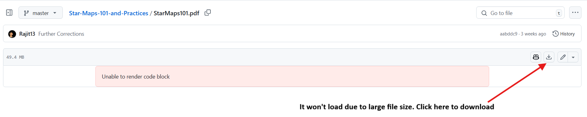

# 🌌 Star Charts 101 and Practices

> A practical, Olympiad-focused guide to mastering **star maps, chart reading, and observational astronomy**.

  

  📄 <a href="StarMaps101.pdf"><strong>Download Latest PDF</strong></a>

---

## ✨ Overview

**Star Charts 101 and Practices** is a structured notebook designed for students preparing for competitions like the *International Olympiad on Astronomy and Astrophysics (IOAA)*.

It combines:
- rigorous star chart interpretation  
- practical observational techniques  
- Olympiad-style reasoning  

This material is actively used in training students for the  
👉 [Bangladesh Olympiad on Astronomy and Astrophysics](https://bdoaa.org)

---

## 🚀 What you'll learn

- 🧭 How to read and interpret star maps efficiently  
- 🌠 Identifying constellations and sky regions  
- 🔭 Foundations of observational astronomy  
- 📊 Olympiad-level problem-solving strategies  
- 🧮 Geometric reasoning behind celestial motion *(implicit, not formula-heavy)*  

---

## 📘 Structure of the guide

The notebook is designed to progress from **intuition → structure → application**:

1. Basics of star charts  
2. Sky orientation and motion  
3. Practical observation techniques  
4. Problem-solving exercises  
5. (In progress) Telescopic observations  
6. (Planned) Celestial coordinate systems  

---

## ⚠️ Current status

This project started in **2016** after my Olympiad experience.

Due to academic commitments (graduate studies, research), development slowed, so:
- Some sections remain incomplete  
- Telescopic observations are being expanded  
- Coordinate systems will be added  

Also, GitHub file size limitations currently restrict further expansion of the compiled PDF.

---

## 🤝 Contributing

Contributions are welcome, especially if you want to improve clarity, add problems, or extend sections.

### Workflow

1. Fork the repository  
2. Create a new branch  
3. Make your changes  
4. Submit a pull request with a clear description  

If you're new to open source, this guide helps:  
👉 https://github.com/gitty-coder/QGIS-Documentation/blob/master/docs/documentation_guidelines/first_contribution.rst  

📩 You can also reach out directly: **farahoshwadhin.13@gmail.com**

---

## 🛠 Built with

- [LaTeX](https://www.latex-project.org/)  
- Git + GitHub workflow  

---

## 📜 License

[![CC BY-NC-SA 4.0][cc-by-nc-sa-shield]][cc-by-nc-sa]

This work is licensed under a  
**Creative Commons Attribution-NonCommercial-ShareAlike 4.0 International License**.

[![CC BY-NC-SA 4.0][cc-by-nc-sa-image]][cc-by-nc-sa]

---

  <a property="dct:title" rel="cc:attributionURL" href="https://github.com/Rajit13/Star-Maps-101-and-Practices">
    Star Charts 101 and Practices
  </a>
  by 
  <a rel="cc:attributionURL dct:creator" property="cc:attributionName" href="https://github.com/Rajit13">
    Fahim Rajit Hossain Shwadhin
  </a>
  is licensed under 
  <a href="http://creativecommons.org/licenses/by-nc-sa/4.0/?ref=chooser-v1" target="_blank" rel="license noopener noreferrer">
    CC BY-NC-SA 4.0
  </a>

[cc-by-nc-sa]: http://creativecommons.org/licenses/by-nc-sa/4.0/
[cc-by-nc-sa-image]: https://licensebuttons.net/l/by-nc-sa/4.0/88x31.png
[cc-by-nc-sa-shield]: https://img.shields.io/badge/License-CC%20BY--NC--SA%204.0-lightgrey.svg
