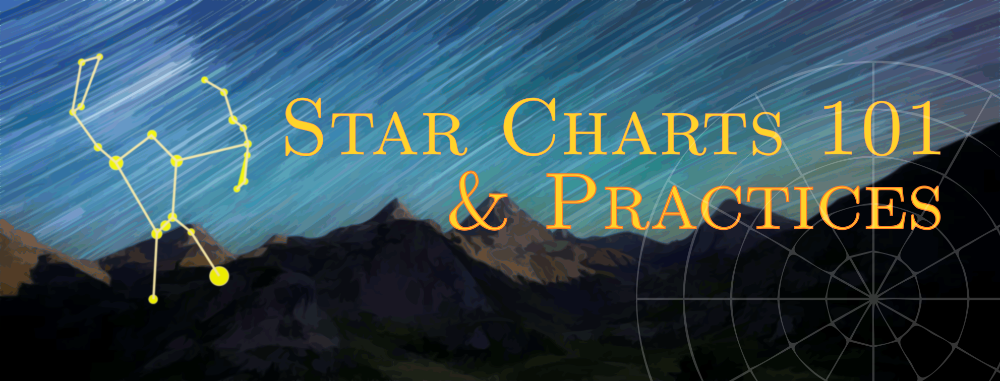

# 🌌 Star Charts 101 and Practices

  

  
  
  

  <em>A practical, Olympiad-focused guide to reading the night sky through star maps, charts, and observation.</em>

---

## ✨ Overview

**Star Charts 101 and Practices** is a notebook and training guide created in preparation for the *International Olympiad on Astronomy and Astrophysics (IOAA)*.

It brings together:
- star map and star chart analysis
- practical astronomical observation
- Olympiad-style training notes
- guided thinking for sky navigation

This material is used in the training of the Bangladesh team at the  
[Bangladesh Olympiad on Astronomy and Astrophysics](https://bdoaa.org).

## 🌠 What this guide covers

- Reading and interpreting star charts
- Finding and identifying sky regions
- Understanding the sky as a changing map
- Practical observation methods
- Telescope-based observation notes
- Planned notes on the celestial coordinate system

## 🌙 A sky-observation approach

This guide is written to feel like learning the sky step by step:
first by recognizing patterns, then by linking them to motion, and finally by using them in real observation.

The goal is not only to memorize star positions, but to develop intuition for how the sky is organized.

## 🧭 Current status

I began writing this book after my Olympiad experience in 2016. As graduate study and other academic commitments took priority, development slowed, and some sections remain incomplete.

I am currently improving:
- telescopic observations
- celestial coordinate system notes

Because of file size limits and the way GitHub handles large repository assets, future updates may be managed through release files rather than direct repository uploads.

## 🤝 Contributing

This book is written in [LaTeX](https://www.latex-project.org/) and published through GitHub. A basic familiarity with TeX and git is helpful.

### Suggested workflow

1. Fork this repository
2. Create a separate branch
3. Make your changes
4. Open a pull request with a clear description

If you are new to contributing, this guide may help:
https://github.com/gitty-coder/QGIS-Documentation/blob/master/docs/documentation_guidelines/first_contribution.rst

You can also contact me by email at **farahoshwadhin.13@gmail.com**.

## 🛠 Built with

- LaTeX
- GitHub
- Educational notes written for astronomy training

## 📜 License

[![CC BY-NC-SA 4.0][cc-by-nc-sa-shield]][cc-by-nc-sa]

This work is licensed under a  
[Creative Commons Attribution-NonCommercial-ShareAlike 4.0 International License][cc-by-nc-sa].

[![CC BY-NC-SA 4.0][cc-by-nc-sa-image]][cc-by-nc-sa]

[cc-by-nc-sa]: http://creativecommons.org/licenses/by-nc-sa/4.0/
[cc-by-nc-sa-image]: https://licensebuttons.net/l/by-nc-sa/4.0/88x31.png
[cc-by-nc-sa-shield]: https://img.shields.io/badge/License-CC%20BY--NC--SA%204.0-lightgrey.svg

  <a property="dct:title" rel="cc:attributionURL" href="https://github.com/Rajit13/Star-Maps-101-and-Practices">
    Star Charts 101 and Practices
  </a>
  by
  <a rel="cc:attributionURL dct:creator" property="cc:attributionName" href="https://github.com/Rajit13">
    Fahim Rajit Hossain Shwadhin
  </a>
  is licensed under
  <a href="http://creativecommons.org/licenses/by-nc-sa/4.0/?ref=chooser-v1" target="_blank" rel="license noopener noreferrer" style="display:inline-block;">
    CC BY-NC-SA 4.0
    
    
    
    
  </a>

