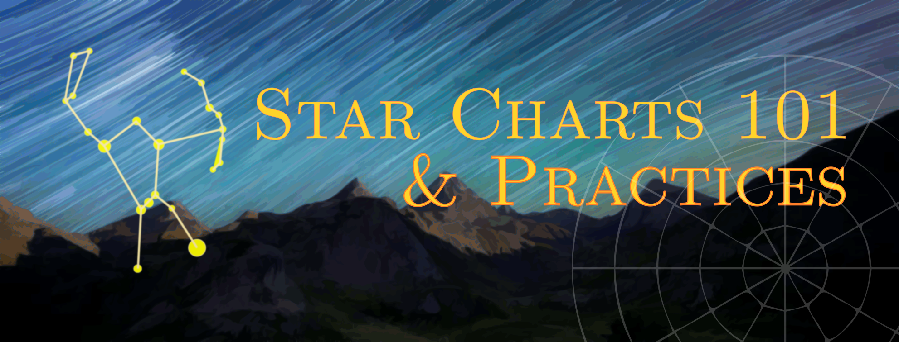

# 🌌 Star Charts 101 and Practices

<p align="center">
  
</p>

<p align="center">
  <a href="https://orcid.org/0009-0002-4699-8059">
    
  </a>
</p>

<p align="center">
  <a href="https://raw.githubusercontent.com/Rajit13/Star-Maps-101-and-Practices/master/StarMaps101.pdf" target="_blank">
    
  </a>
  <a href="https://rajit13.github.io/starcharts101/" target="_blank">
    
  </a>
  <a href="https://github.com/Rajit13/Star-Maps-101-and-Practices/releases" target="_blank">
    
  </a>
  <a href="https://github.com/Rajit13/Star-Maps-101-and-Practices/stargazers" target="_blank">
    
  </a>
  <a href="https://github.com/Rajit13/Star-Maps-101-and-Practices/network/members" target="_blank">
    
  </a>
  
</p>

<p align="center">
  <em>A practical problem-solving companion for star charts and observational astronomy.</em>
</p>

---

## ✨ Overview

**Star Charts 101 and Practices** is a practice book dedicated to astronomy enthusiasts and students preparing for the Star Charts/Observational Round of Astronomy and Earth Science Olympiads. It is not a full star atlas; rather, it is intended as a practical problem-solving companion.

The book is based on the author's experience as a participant in two international Olympiads, an IOAA team leader since 2018, a stargazer, and an observational astronomer. It develops the fundamental knowledge needed for computations associated with studying the sky and the positions of celestial objects, with a particular focus on naked-eye observational astronomy. Practical examples increase progressively in complexity, and the emphasis is on understanding the sky systematically rather than memorizing every constellation.

This material is used in the training of the Bangladesh team at the  
[Bangladesh Olympiad on Astronomy and Astrophysics](https://bdoaa.org).

## 🕸 Interactive knowledge graph

The repository includes an Obsidian-style interactive knowledge graph that connects book sections, previous observation practice, IOAA 2025 Observation tasks (OM, OT and OP), and identified areas for additional training.

**[Open the interactive Star Charts 101 knowledge graph](https://rajit13.github.io/starcharts101/)**

The graph supports search, OM/OT/OP filtering, relationship filtering, node dragging, zooming, neighbour highlighting and direct source links. Its canonical source is [`star-maps-101-graph.html`](star-maps-101-graph.html) in this repository; the hosted page loads that source so repository updates can be reflected online without maintaining a separate graph copy.

## 🌠 What this guide covers

- Reading and interpreting star charts
- Finding and identifying sky regions
- Understanding the sky as a changing map
- Practical observation methods
- Telescope-based observation notes
- Planned notes on the celestial coordinate system

## 🌙 A sky-observation approach

This guide is written to feel like learning the sky step by step:
first by recognizing patterns, then by linking them to motion, and finally by using them in real observation.

The goal is not only to memorize star positions, but to develop intuition for how the sky is organized.

## 🧭 Current status

I began writing this book after my Olympiad experience in 2016. As graduate study and other academic commitments took priority, development slowed, and some sections remain incomplete.

I am currently improving:
- telescopic observations
- celestial coordinate system notes

Compiled PDF updates are published through [GitHub Releases](https://github.com/Rajit13/Star-Maps-101-and-Practices/releases). Release names follow the format `v_YYYY-MM-DD`, based on the date of the latest update to `StarMaps101.pdf`. The **Open Latest PDF** button above opens the PDF file directly in a new browser tab; the release page remains available for downloading specific versions.

## 📚 Additional reading for Astronomy Olympiad preparation

- [Astronomy Problem of the Day — problem collection PDF](https://rajit13.github.io/website_docs/Astro_POTD.pdf)
- [জ্যোতির্বিজ্ঞানের যতকিছু — অলিম্পিয়াড ও অন্যান্য](https://www.rokomari.com/book/471442/jyotirbigganer-jotokichu)

## 🤝 Contributing

This book is written in [LaTeX](https://www.latex-project.org/) and published through GitHub. A basic familiarity with TeX and git is helpful.

### Suggested workflow

1. Fork this repository
2. Create a separate branch
3. Make your changes
4. Open a pull request with a clear description

If you are new to contributing, this guide may help:
https://github.com/gitty-coder/QGIS-Documentation/blob/master/docs/documentation_guidelines/first_contribution.rst

You can also contact me by email at **farahoshwadhin.13@gmail.com**.

## 🛠 Built with

- LaTeX
- GitHub
- GitHub Pages
- Educational notes written for astronomy training

## 📖 Citation

If you use this material, please cite:

```bibtex
@misc{hossain_starcharts_101,
  author       = {Shwadhin, Fahim Rajit Hossain},
  title        = {Star Charts 101 and Practices},
  year         = {2026},
  howpublished = {\url{https://github.com/Rajit13/Star-Maps-101-and-Practices}},
  note         = {Educational astronomy guide for Olympiad training. ORCID: 0009-0002-4699-8059},
  urldate      = {2026-04-27}
}
````

## 📜 License

[![CC BY-NC-SA 4.0][cc-by-nc-sa-shield]][cc-by-nc-sa]

This work is licensed under a  
[Creative Commons Attribution-NonCommercial-ShareAlike 4.0 International License][cc-by-nc-sa].

[![CC BY-NC-SA 4.0][cc-by-nc-sa-image]][cc-by-nc-sa]

[cc-by-nc-sa]: http://creativecommons.org/licenses/by-nc-sa/4.0/
[cc-by-nc-sa-image]: https://licensebuttons.net/l/by-nc-sa/4.0/88x31.png
[cc-by-nc-sa-shield]: https://img.shields.io/badge/License-CC%20BY--NC--SA%204.0-lightgrey.svg

<p xmlns:cc="http://creativecommons.org/ns#" xmlns:dct="http://purl.org/dc/terms/">
  <a property="dct:title" rel="cc:attributionURL" href="https://github.com/Rajit13/Star-Maps-101-and-Practices">
    Star Charts 101 and Practices
  </a>
  by
  <a rel="cc:attributionURL dct:creator" property="cc:attributionName" href="https://github.com/Rajit13">
    Fahim Rajit Hossain Shwadhin
  </a>
  is licensed under
  <a href="http://creativecommons.org/licenses/by-nc-sa/4.0/?ref=chooser-v1" target="_blank" rel="license noopener noreferrer" style="display:inline-block;">
    CC BY-NC-SA 4.0
    
    
    
    
  </a>
</p>
